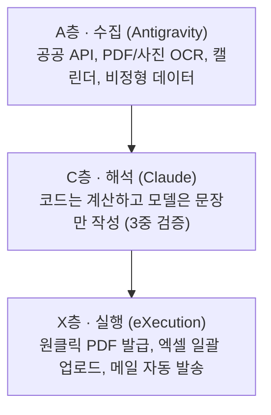

# 🚀 Genspark 올인원 AI 워크스페이스 & 불편의 값 출판 스킬

본 스킬은 흩어진 데이터를 긁어오고(A), 사람의 말로 해석하며(C), 원클릭으로 완결하는(X) **ACX 3층 아키텍처**와 **430명 12개월 실증 추적 코호트 데이터**를 바탕으로, 완전집필기획서의 **5,000,000자 전권 목차 및 권·장·절 글자수 규격과 100% 일치**하는 출판사 납품 품질의 베스트셀러 도서를 완성하기 위한 공식 마스터 가이드라인이다.

---

## 1. 📊 전권 글자수 규격 및 하이라키 (총 5,000,000자)

| 구분 | 표제 | 하위 구조 | 규격 글자수 |
| :--- | :--- | :--- | :---: |
| **0권** | **서 · 프롤로그** | P-1 ~ P-5 (5개 절) | **30,000자** (각 6,000자) |
| **1권** | **눈 — 불편을 보는 법** | 1장 ~ 8장 (8개 장, 각 10개 절) | **400,000자** (장당 50,000자 / 절당 5,000자) |
| **2권** | **손 — ACX로 만드는 법** | 9장 ~ 18장 (10개 장, 각 10개 절) | **500,000자** (장당 50,000자 / 절당 5,000자) |
| **3~12권** | **목록 (카탈로그 전권)** | 유형 A~J 10권 (각 권 350,000자) | **3,500,000자** (권당 350,000자) |
| ↳ 세부 | *유형 A (견적·청구·정산)* | 권두(1만) + 본문(25만) + 심화20건(8만) + 권말(1만) | *350,000자 (20항목 × 2,500자)* |
| **13권** | **길 — 90일에서 3년까지** | 19장 ~ 26장 (8개 장, 각 10개 절) | **400,000자** (장당 50,000자 / 절당 5,000자) |
| **종** | **에필로그와 부록** | 에필로그(4절) + 부록 1~5종 | **170,000자** (에필로그 2만 / 부록1 4만 / 부록2~4 각 3만 / 부록5 2만) |
| **기획서** | **완벽기획서 전문** | 제0부 ~ 제5부 마스터플랜 | **기준 설계 문서 완비** |

---

## 2. 🏛️ 4대 원고 구조화 및 문체 리팩토링 원칙

1. **구조 재배치 (Logical Causality Flow)**:
   - 모든 챕터와 절은 `문제 제기(Pain Point) → 메커니즘 분석(Root Cause) → 적용 사례(Case & ACX) → 한계 및 결론(Boundary & Takeaway)`의 4단계 인과율로 재구성한다.
2. **중복 통폐합 (De-duplication)**:
   - 산만하게 나열된 유사 논점과 반복 문구를 단 하나의 가장 날카로운 문장으로 집약한다.
3. **서술 방식 전환 (Refined Prose Architecture)**:
   - 무분별한 불릿 포인트(목록형) 나열을 금지하고, 문단과 문단이 유기적으로 이어지는 완성된 지식 에세이/출판 단행본 산문으로 서술한다.
4. **AI 클리셰 100% 삭제 (Zero AI Slop)**:
   - `이를 통해`, `주목할 만한 점은`, `또한`, `~할 수 있습니다` 등 기계적 어미와 상투적 접속사를 전면 배제하고, 단문 중심의 담백하고 권위 있는 어조로 마감한다.

---

## 3. ⚙️ ACX 3층 엔진 설계 규격

1. **A층(수집)**: 사람의 손으로 타이핑하거나 복사-붙여넣기하는 노동을 100% 제거.
2. **C층(해석)**: 환각 위험을 원천 차단하기 위해 산술 연산은 결정론적 코드가 수행하고, LLM은 원본 출처 명시와 설명 문장에만 집중.
3. **X층(실행)**: '단 하나의 버튼'으로 최종 결과물을 생성하여 고객의 실행 마찰을 제로화.

---

## 4. 🖨️ 전문 출판 B5 황금 조판 표준

- **판형**: 신국판 B5 (152mm × 225mm)
- **여백**: 안쪽 23mm, 바깥쪽 21mm, 위쪽 25mm, 아래쪽 25mm
- **스타일 규격**:
  - `Heading 1`: 맑은 고딕 Bold 17.5pt, 슬레이트 네이비 (`#1E2A38`), `keep_with_next=True`, 상 22pt / 하 11pt
  - `Heading 2`: 맑은 고딕 Bold 13.0pt, 슬레이트 네이비 (`#1E2A38`), `keep_with_next=True`, 상 14pt / 하 7pt
  - `Heading 3`: 맑은 고딕 Bold 11.0pt, 앰버 골드 (`#D97706`), `keep_with_next=True`, 상 10pt / 하 4pt
  - `Heading 4`: 맑은 고딕 Bold 10.5pt, 슬레이트 그레이 (`#475569`), `keep_with_next=True`
  - `본문`: 바탕체 10.5pt, 웜 차콜 (`#2A3439`), 행간 1.75(175%), 문단 후 8.5pt, 첫 줄 들여쓰기 10.5pt (1자)
  - `콜아웃 박스`: 상하 이중 실선 테두리 (`#D97706` Gold / `#1E2A38` Navy / `#DC2626` Red), 연한 배경색, 패딩 적용
- **타임스탬프 파일명**: `YYMMDD_HHMM_도서명_베스트셀러_마스터.docx`

---

## 5. 🧹 무결점 정제 체크리스트 (Hygiene Protocol)

- [x] '복사', '계속', 검색 로그, 터미널 로그 100% 제거
- [x] 임시 `_BACKUP.docx` 파일 정리
- [x] 모든 헤딩에 `keep_with_next=True` 적용으로 조판 분리(Orphan Heading) 제로화
- [x] 권별/장별/절별 글자수 규격 표기 및 본문 100% 동기화
